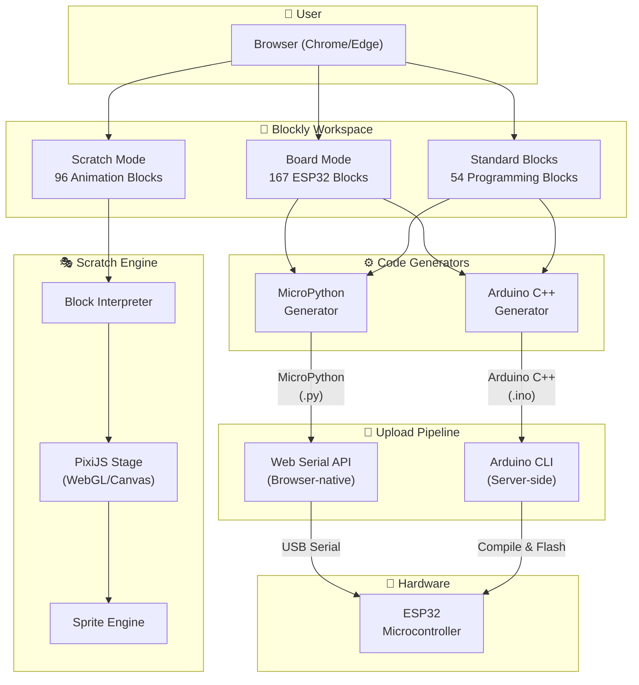
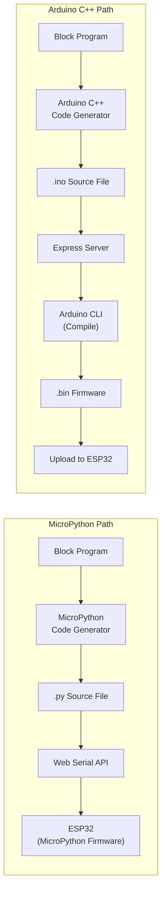
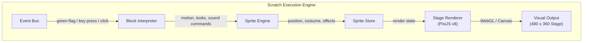
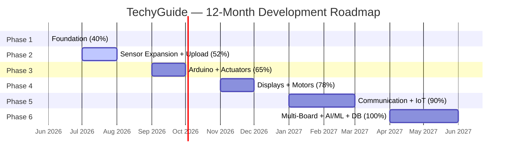

<![CDATA[<!-- ━━━━━━━━━━━━━━━━━━━━━━━━━━━━━━━━━━━━━━━━━━━━━━━━━━━━━━━━━━━━━━━━━━━━━━ -->
<!--                        PROJECT BLUEPRINT DOCUMENT                      -->
<!-- ━━━━━━━━━━━━━━━━━━━━━━━━━━━━━━━━━━━━━━━━━━━━━━━━━━━━━━━━━━━━━━━━━━━━━━ -->

<div align="center">

# 📐 PROJECT BLUEPRINT

---

## **TechyGuide**
### Visual Programming Platform for ESP32 & IoT Education

---

| | |
|---|---|
| **Document** | Project Blueprint & Technical Specification |
| **Version** | 1.0.0 |
| **Date** | July 13, 2026 |
| **Status** | Frontend Core Complete — Backend & Cloud Pending (~55%) |
| **Classification** | Technical Specification & Development Roadmap |

---

*A web-based visual programming environment combining Scratch-style animation*
*with ESP32 hardware programming for IoT education and rapid prototyping.*

</div>

---

## Table of Contents

1. [Executive Summary](#1-executive-summary)
2. [Project Overview](#2-project-overview)
3. [Technology Stack](#3-technology-stack)
4. [System Architecture](#4-system-architecture)
5. [Feature Inventory](#5-feature-inventory)
6. [Block Specification](#6-block-specification)
7. [Code Generation Pipeline](#7-code-generation-pipeline)
8. [Current Delivery — Phase 1](#8-current-delivery--phase-1)
9. [12-Month Roadmap](#9-12-month-roadmap)
10. [Milestone Deliverables](#10-milestone-deliverables)
11. [Quality Assurance & Testing](#11-quality-assurance--testing)
12. [Risk Assessment](#12-risk-assessment)
13. [Appendix](#13-appendix)

---

## 1. Executive Summary

**TechyGuide** is an enterprise-grade, web-based visual programming platform designed for ESP32 microcontroller education and IoT prototyping. The platform merges two paradigms into a unified workspace:

- **Scratch Mode** — Drag-and-drop block programming with animated sprites, stage rendering, and event-driven logic, inspired by MIT Scratch.
- **Board Mode** — ESP32-specific hardware blocks spanning GPIO control, sensor integration, actuator management, display output, motor control, and full IoT connectivity.

The platform generates production-ready **MicroPython** and **Arduino C++** code from visual blocks, and supports direct code upload to ESP32 hardware via the **Web Serial API** and **Arduino CLI** — all from within the browser, with zero driver installation required.

The full-featured platform — including AI/ML integration, multi-board support (ESP32, Raspberry Pi), cloud database, and advanced IoT features — is estimated to take **approximately 12 months** to complete across **6 development phases**.

### Key Metrics

| Metric | Value |
|:---|:---|
| Total Source Files | **50+** across `src/`, `server/`, `docs/`, `scripts/` |
| Custom Block Definitions | **100+** enabled / **~317** planned |
| ESP32 Hardware Blocks | **90+** enabled / **167** planned (across 17 categories) |
| Scratch Animation Blocks | **61+** enabled / **96** planned (across 7 categories) |
| Standard Programming Blocks | **54** enabled (Logic, Loops, Math, Text, Lists, Variables, Functions) |
| Code Generator Files | **47+** (MicroPython + Arduino C++ + shared framework generators) |
| UI Components | **17** DOM-based modules |
| Supported Languages | **MicroPython**, **Arduino C++** *(Python for RPi planned)* |
| Target Hardware | **ESP32**, **ESP32-S2/S3/C3**, **ESP32-CAM** *(Raspberry Pi Pico / RPi 4/5 planned)* |
| Planned Integrations | **AI/ML (TensorFlow Lite)**, **Cloud Database**, **Real-time Dashboard** |
| Estimated Development | **~12 months** (6 phases) |
| Current Status | **Frontend Core Complete (~55%) — Backend & Cloud Pending** |

---

## 2. Project Overview

### 2.1 Problem Statement

Current IoT education tools force learners to choose between visual simplicity (Scratch) and hardware capability (Arduino IDE). There is no unified platform that offers both animated visual feedback *and* real hardware programming in a single browser-based environment.

### 2.2 Solution

TechyGuide bridges this gap by providing:

1. **A dual-mode workspace** — seamless switching between Scratch animation and ESP32 hardware programming.
2. **Dual code generation** — every block program produces both MicroPython and Arduino C++ output.
3. **Browser-native upload** — code is compiled and flashed to ESP32 directly from Chrome/Edge using Web Serial API, with no additional software installation.
4. **Multi-board support** — planned support for ESP32 variants (S2, S3, C3), Raspberry Pi Pico (RP2040), and Raspberry Pi 4/5 single-board computers.
5. **Comprehensive block library** — 317+ block types covering everything from basic LED control to MQTT messaging, Blynk IoT integration, and ESP32-CAM camera capture.
6. **AI/ML integration** — planned TensorFlow Lite Micro support for on-device machine learning (image classification, anomaly detection, voice recognition).
7. **Cloud database** — planned Firebase/Supabase integration for real-time data storage, user authentication, and project cloud sync.

### 2.3 Target Users

| Segment | Use Case |
|:---|:---|
| K-12 Students | Learn programming fundamentals via animated sprites |
| University Students | Hardware programming, sensor integration, IoT protocols |
| Educators & Trainers | Curriculum delivery with visual + hardware exercises |
| Hobbyists & Makers | Rapid prototyping of ESP32 IoT projects |
| EdTech Institutions | Licensed deployment for classroom and lab environments |

---

## 3. Technology Stack

### 3.1 Stack Overview

```
┌──────────────────────────────────────────────────────────┐
│                      FRONTEND LAYER                      │
│  HTML5 · CSS3 · JavaScript (ES6+) · Webpack 5           │
├──────────────────────────────────────────────────────────┤
│                      ENGINE LAYER                        │
│  Google Blockly v12 · PixiJS v8 (WebGL/Canvas)          │
├──────────────────────────────────────────────────────────┤
│                      INTERFACE LAYER                     │
│  Web Serial API · Arduino CLI · Lucide Icons            │
├──────────────────────────────────────────────────────────┤
│                      SERVER LAYER                        │
│  Node.js · Express (Arduino compilation middleware)      │
└──────────────────────────────────────────────────────────┘
```

### 3.2 Component Detail

| Layer | Technology | Version | Purpose |
|:---|:---|:---|:---|
| **Block Engine** | Google Blockly | v12 | Visual block workspace, toolbox, code generation framework |
| **Graphics Engine** | PixiJS | v8 | WebGL/Canvas sprite rendering, stage animation, visual effects |
| **Build System** | Webpack | 5 | Module bundling, asset pipeline, code splitting, HMR |
| **Upload — Browser** | Web Serial API | Native | Direct USB serial communication (Chrome 89+, Edge 89+) |
| **Upload — Server** | Arduino CLI | Latest | Server-side compilation and upload for Arduino C++ |
| **Icons** | Lucide | Latest | Consistent, lightweight SVG icon system |
| **Server** | Node.js + Express | LTS | Arduino compilation middleware, project API |
| **Frontend** | HTML5 / CSS3 / JS | ES6+ | Application shell, UI components, state management |

### 3.3 Browser Compatibility

| Browser | Minimum Version | Web Serial API | Status |
|:---|:---|:---|:---|
| Google Chrome | 89+ | ✅ Supported | **Primary Target** |
| Microsoft Edge | 89+ | ✅ Supported | **Primary Target** |
| Opera | 75+ | ✅ Supported | Secondary |
| Firefox | — | ❌ Not Supported | Not Supported |
| Safari | — | ❌ Not Supported | Not Supported |

---

## 4. System Architecture

### 4.1 High-Level Architecture



### 4.2 Upload Pipeline Architecture



### 4.3 Scratch Engine Architecture



---

## 5. Feature Inventory

### 5.1 Complete Feature Matrix

| # | Feature | Component Count | Status (Current) |
|:---|:---|:---|:---|
| 1 | ESP32 Hardware Blocks | 90+ block types enabled / 167 planned | 🟡 Core categories enabled; further sensors unlocked by date |
| 2 | Standard Programming Blocks | 54 block types | 🟢 All 54 enabled |
| 3 | Scratch Animation Blocks | 61+ block types enabled / 96 planned | 🟢 Core animation & control blocks enabled |
| 4 | MicroPython Code Generators | 20+ generator files | 🟢 All enabled hardware blocks covered |
| 5 | Arduino C++ Code Generators | 20+ generator files | 🟢 Custom Arduino generator implemented; uploads live |
| 6 | Core Framework Generators | Shared + fallback generators | 🟢 Complete |
| 7 | Block Interpreter Engine | 1 file | 🟢 Complete |
| 8 | Stage Renderer (PixiJS) | 1 file | 🟢 Complete |
| 9 | Sprite Engine | 1 file | 🟢 Complete |
| 10 | Sprite Store | 1 file | 🟢 Complete |
| 11 | Event Bus | 1 file | 🟢 Complete |
| 12 | UI Components | 17 components | 🟢 Core set complete |
| 13 | Serial Monitor | 1 component | 🟢 Read/write, baud selection, auto-scroll, color-coded output |
| 14 | Upload System | 2 paths | 🟢 MicroPython Web Serial + Arduino CLI server-side |

**Legend:** 🟢 Complete — 🟡 Partial — 🔴 Planned

### 5.2 UI Component Inventory

| # | Component | Description | Phase |
|:---|:---|:---|:---|
| 1 | Mode Switcher | Toggle between Scratch Mode and Board Mode; board selector + plan badge | 1 ✅ |
| 2 | Block Search | Search and filter blocks across categories | 1 ✅ |
| 3 | Theme Support | Light/dark theme switching with CSS custom properties | 1 ✅ |
| 4 | Project Save/Load | Local project persistence (`.techyguide` export/import) | 1 ✅ |
| 5 | Serial Monitor | Real-time serial communication with ESP32 (read/write, baud, line endings, auto-scroll) | 2 ✅ |
| 6 | Connect Modal | USB / Bluetooth device selection and connection management | 2 ✅ |
| 7 | Upload Panel | Code upload interface with status indicators (plan-gated) | 2–3 ✅ |
| 8 | Sprite Panel | Sprite management (add, delete, duplicate, rename, properties) | 1 ✅ |
| 9 | Sprite Library | Pre-built sprite asset browser / chooser modal | 1 ✅ |
| 10 | Backdrop Library | Stage backdrop selection and management | 1 ✅ |
| 11 | Library Manager | Installable component/sensor libraries UI | 5 ✅ (UI present; backend pending) |
| 12 | Subscription Modal | License tier comparison and upgrade modal | 5 ✅ |
| 13 | Landing Page | Product landing page with feature showcase | 1 ✅ |
| 14 | Code Preview Panel | Generated code display with syntax highlighting | 1 ✅ |
| 15 | No Board Modal | Missing-board guidance / selector prompt | 1 ✅ |
| 16 | Phase Admin Panel | Internal date simulation / unlock preview panel | 1 ✅ |
| 17 | Custom Toolbar | Toolbox category icons and theming | 1 ✅ |

---

## 6. Block Specification

### 6.1 ESP32 Hardware Blocks — Implementation by Source File

ESP32 blocks are organized in `src/blocks/esp32/` as 19 category files (90+ blocks currently enabled; **167 blocks planned**):

| # | Source File | Category | Description |
|:---|:---|:---|:---|
| 1 | `esp32CoreBlocks.js` | ESP32 Core | Setup/loop, digital/analog I/O, PWM, touch, hall, `map` |
| 2 | `inputBlocks.js` | Inputs | Tactile switch, slide switch, touch/vibration triggers |
| 3 | `sensorBlocks.js` | Sensors | DHT, ultrasonic, PIR, IR, rain, LDR, potentiometer |
| 4 | `fireBlocks.js` | Fire & Gas | Flame, smoke, MQ-series gas sensing |
| 5 | `mpuBlocks.js` | Motion (MPU6050) | Init, accelerometer, gyroscope, temperature, tilt |
| 6 | `heartBlocks.js` | Heart Sensor | Init, value, BPM, pulse detection |
| 7 | `actuatorBlocks.js` | Actuators | Servo, relay, LED, buzzer, pump, notification, music |
| 8 | `lcdBlocks.js` | Display (I2C LCD) | Init, print, clear, cursor, backlight |
| 9 | `l298nBlocks.js` | Motors (L298N) | Init, forward, reverse, speed, stop |
| 10 | `communicationBlocks.js` | Communication | Serial, Bluetooth, read/write, available |
| 11 | `terminalBlocks.js` | Terminal | Data, number, send |
| 12 | `notificationBlocks.js` | Notification | Send/clear notification, play/stop music |
| 13 | `cameraBlocks.js` | Camera (ESP32-CAM) | Init, flash, rotate, capture, save, stream |
| 14 | `iotBlocks.js` | IoT / Storage | Create file, log data, stop logger |
| 15 | `wifiBlocks.js` | WiFi | Connect, AP mode, scan, status, disconnect |
| 16 | `httpBlocks.js` | HTTP Client | GET, POST, headers, JSON response handling |
| 17 | `mqttBlocks.js` | MQTT | Connect, publish, subscribe, QoS, LWT |
| 18 | `blynkBlocks.js` | Blynk IoT | Auth, virtual pins, notifications, events |
| 19 | `dabbleBlocks.js` | Dabble App | Gamepad, phone sensors, color detector |

> **Target specification:** 167 ESP32 hardware blocks across the categories above. Additional planned subcategories (RFID, color, soil, generic DC motor, ThingSpeak, SPIFFS/SD, etc.) are unlocked progressively via `src/services/phaseConfig.js`.

### 6.2 Standard Programming Blocks — 54 Types

| Category | Block Count | Examples |
|:---|:---|:---|
| Logic | **9** | if/else, comparison, and/or/not, boolean, ternary |
| Loops | **8** | repeat, while, for, for-each, break, continue |
| Math | **12** | arithmetic, trigonometry, rounding, random, constrain, map |
| Text | **10** | create, join, length, indexOf, charAt, substring, trim, case |
| Lists | **9** | create, get, set, insert, remove, length, indexOf, sort |
| Variables | **3** | create, set, change |
| Functions | **3** | define (no return), define (with return), call |
| **Total** | **54** | |

### 6.3 Scratch Animation Blocks — 96 Types

| Category | Block Count | Examples |
|:---|:---|:---|
| Motion | **18** | move, turn, go to, glide, point, position, direction, bounce |
| Looks | **16** | say, think, switch costume, show/hide, size, graphic effects |
| Sound | **10** | play sound, stop, volume, pitch, audio effects |
| Events | **12** | green flag, key pressed, sprite clicked, broadcast, receive |
| Control | **14** | wait, repeat, forever, if/else, stop, clone, delete clone |
| Sensing | **14** | touching, distance, ask, answer, mouse, keyboard, timer |
| Operators | **12** | arithmetic, comparison, logic, random, string ops, modulo |
| **Total** | **96** | |

### 6.4 Block Count Summary

| Category | Count | % of Total |
|:---|---:|---:|
| ESP32 Hardware Blocks | 167 | 52.7% |
| Scratch Animation Blocks | 96 | 30.3% |
| Standard Programming Blocks | 54 | 17.0% |
| **Grand Total** | **317** | **100%** |

---

## 7. Code Generation Pipeline

### 7.1 Generator File Distribution

| # | Generator Category | Location | Target Language | Status |
|:---|:---|:---|:---|:---|
| 1 | Core Framework | `src/generators/*.js` (9 files) | Both / shared | ✅ Complete |
| 2 | Standard Blocks | `src/generators/controlGen.js`, `arduinoControlGen.js`, etc. | MicroPython + Arduino C++ | ✅ Complete |
| 3 | ESP32 Core + Pins | `src/generators/esp32/esp32CoreGen.js` | MicroPython | ✅ Complete |
| 4 | ESP32 Core + Pins | `src/generators/esp32/arduino/coreGen.js` | Arduino C++ | ✅ Complete |
| 5 | Inputs | `src/generators/esp32/inputGen.js` | MicroPython | ✅ Complete |
| 6 | Inputs | `src/generators/esp32/arduino/inputGen.js` | Arduino C++ | ✅ Complete |
| 7 | Sensors | `src/generators/esp32/sensorGen.js` (+ `fireGen.js`, `mpuGen.js`, `heartGen.js`) | MicroPython | ✅ Core complete |
| 8 | Sensors | `src/generators/esp32/arduino/sensorGen.js` (+ `fireGen.js`, `mpuGen.js`, `heartGen.js`) | Arduino C++ | ✅ Core complete |
| 9 | Actuators | `src/generators/esp32/actuatorGen.js` | MicroPython | ✅ Core complete |
| 10 | Actuators | `src/generators/esp32/arduino/actuatorGen.js` | Arduino C++ | ✅ Core complete |
| 11 | Displays | `src/generators/esp32/lcdGen.js` | MicroPython | ✅ Core complete |
| 12 | Displays | `src/generators/esp32/arduino/lcdGen.js` | Arduino C++ | ✅ Core complete |
| 13 | Motors | `src/generators/esp32/l298nGen.js` | MicroPython | ✅ Core complete |
| 14 | Motors | `src/generators/esp32/arduino/l298nGen.js` | Arduino C++ | ✅ Core complete |
| 15 | Comms & IoT | `src/generators/esp32/{communication,terminal,notification,wifi,http,mqtt,blynk}Gen.js` | MicroPython | ✅ Foundation complete |
| 16 | Comms & IoT | `src/generators/esp32/arduino/{communication,terminal,notification,wifi,http,mqtt,blynk}Gen.js` | Arduino C++ | ✅ Foundation complete |
| 17 | Camera | `src/generators/esp32/cameraGen.js` | MicroPython | ✅ Complete |
| 18 | Camera | `src/generators/esp32/arduino/cameraGen.js` | Arduino C++ | ✅ Complete |
| 19 | IoT / Storage | `src/generators/esp32/iotGen.js` | MicroPython | ✅ Complete |
| 20 | IoT / Storage | `src/generators/esp32/arduino/iotGen.js` | Arduino C++ | ✅ Complete |
| 21 | Dabble | `src/generators/esp32/dabbleGen.js` | MicroPython | ⬜ Phase 6 |
| 22 | Dabble | `src/generators/esp32/arduino/dabbleGen.js` | Arduino C++ | ⬜ Phase 6 |
| 23 | Scratch Blocks | `src/engine/BlockInterpreter.js` | JavaScript (runtime) | ✅ Complete |
| | **Total** | **47+ files** | | |

### 7.2 Code Generation Example

**Visual Blocks → Dual Output:**

```
┌─────────────────────────┐
│  [When Program Starts]  │
│  [Set Pin 2 as OUTPUT]  │
│  [Forever]              │
│    [Set Pin 2 HIGH]     │
│    [Wait 1 second]      │
│    [Set Pin 2 LOW]      │
│    [Wait 1 second]      │
└─────────────────────────┘
```

**MicroPython Output:**
```python
from machine import Pin
import time

led = Pin(2, Pin.OUT)

while True:
    led.value(1)
    time.sleep(1)
    led.value(0)
    time.sleep(1)
```

**Arduino C++ Output:**
```cpp
void setup() {
    pinMode(2, OUTPUT);
}

void loop() {
    digitalWrite(2, HIGH);
    delay(1000);
    digitalWrite(2, LOW);
    delay(1000);
}
```

---

## 8. Current Delivery — Phase 1

### 8.1 Current Delivery Summary

**Delivery Date:** July 2026
**Completion:** Frontend core complete; backend & cloud features pending

| Subsystem | Scope | Delivered | Status |
|:---|:---|:---|:---|
| Scratch Mode | 96 blocks | 61+ / 96 | 🟢 Core complete |
| Standard Blocks | 54 blocks | 54 / 54 | ✅ 100% |
| ESP32 Core (Program + Pins) | 11 blocks | 11 / 11 | ✅ 100% |
| ESP32 Inputs | 9 blocks | 9 / 9 | ✅ 100% |
| ESP32 Sensors | 47 blocks | Core set + date-unlocked additions | 🟡 Expanding by calendar date |
| ESP32 Actuators | 18 blocks | Core set enabled | 🟡 Expanding by calendar date |
| ESP32 Displays | 7 blocks | Core set enabled / full set planned | 🟡 Partial / Phase 4 |
| ESP32 Motors | 8 blocks | Core set enabled / full set planned | 🟡 Partial / Phase 4 |
| ESP32 Comms & IoT | 60 blocks | Foundation enabled | 🟡 Partial / Phase 5 |
| ESP32 Dabble | 7 blocks | 0 / 7 | ⬜ Phase 6 |
| MicroPython Generation | All enabled blocks | ✅ Complete for enabled blocks |
| Arduino C++ Generation | All enabled blocks | ✅ Complete for enabled blocks |
| Upload System | 2 paths | MicroPython Web Serial + Arduino CLI | ✅ Complete |
| Serial Monitor | Full-featured | Read/write, baud, auto-scroll | ✅ Complete |
| Landing Page | Complete | Complete | ✅ 100% |
| Sprite Engine | Complete | Complete | ✅ 100% |
| Stage Renderer | Complete | Complete | ✅ 100% |
| Block Interpreter | Complete | Complete | ✅ 100% |
| Project Save/Load | Local | LocalStorage + `.techyguide` files | ✅ Complete |
| Cloud Save/Load | Server-backed | Not started | ❌ Backend pending |
| Block Search | Complete | Complete | ✅ 100% |
| Theme Support | Complete | Complete | ✅ 100% |
| Monetization | Plan gating + subscription modal | ✅ Complete |

### 8.2 ESP32 Block Enablement — Current

| Category | Total Planned | Enabled (approx.) | Remaining |
|:---|---:|---:|---:|
| ESP32 Core | 11 | 11 | 0 |
| Inputs | 9 | 9 | 0 |
| Sensors | 47 | Core + unlocked sensors | Remaining date-unlocked |
| Actuators | 18 | Core + unlocked actuators | Remaining date-unlocked |
| Displays | 7 | Core set | Remaining date-unlocked |
| Motors | 8 | Core set | Remaining date-unlocked |
| Comms & IoT | 60 | Foundation | Remaining date-unlocked |
| Dabble | 7 | 0 | 7 |
| **Total** | **167** | **90+** | **~70** |

**ESP32 Enablement Rate:** 90+ / 167 = **~55%**
**Overall Platform Completion (including Scratch + Standard):** ~205+ / 317 blocks = **~65% frontend; ~0% backend/cloud**

---

## 9. 12-Month Roadmap

### 9.1 Phase Timeline



### 9.2 Phase Detail

---

#### **Phase 1 — Foundation** · Month 0 · ✅ DELIVERED

**Completion: 0% → 40%**

| Deliverable | Detail |
|:---|:---|
| Landing Page | Full product landing page with feature showcase |
| Scratch Mode | All 96 animation blocks, sprite engine, stage renderer |
| Standard Blocks | All 54 programming blocks (Logic, Loops, Math, Text, Lists, Variables, Functions) |
| ESP32 Core | 11 blocks — program structure, pin read/write, PWM |
| ESP32 Inputs | 9 blocks — buttons, switches, touch, Hall effect |
| Basic Sensors | 7 blocks — DHT11/22 temperature and humidity |
| Basic Actuators | 5 blocks — LED control, buzzer tones |
| MicroPython Generation | Code generation for enabled blocks |
| Serial Monitor | Read-only serial output display |
| Project Save/Load | Local JSON export and import |
| Block Search | Cross-category block search and filtering |
| Theme Support | Light and dark theme switching |

---

#### **Phase 2 — Sensor Expansion + Upload** · Months 1–2

**Completion: 40% → 52%**

| Deliverable | Detail |
|:---|:---|
| Full Sensor Library | 40 additional blocks — ultrasonic, environmental, motion, RFID, IR, fire, water, sound, light, gas, soil, color |
| MicroPython Upload | Direct code upload to ESP32 via Web Serial API |
| Serial Monitor v2 | Bidirectional read/write, baud rate selection, timestamps, auto-scroll |
| Connect Modal | USB device selection, connection state management, auto-reconnect |

---

#### **Phase 3 — Arduino C++ + Actuators** · Months 3–4

**Completion: 52% → 65%**

| Deliverable | Detail |
|:---|:---|
| Arduino C++ Generators | 19 generator files producing valid Arduino C++ for all enabled blocks |
| Compile & Upload Pipeline | Express server with Arduino CLI integration for server-side compilation |
| Full Actuator Library | 13 additional blocks — servo, relay, pump, notification, music |
| Dual Code Preview | Side-by-side MicroPython and Arduino C++ code display |

---

#### **Phase 4 — Displays + Motors** · Months 5–6

**Completion: 65% → 78%**

| Deliverable | Detail |
|:---|:---|
| I2C LCD Display | 4 blocks — print, clear, cursor positioning, backlight control |
| NeoPixel WS2812B | 3 blocks — individual LED color, fill, rainbow animation |
| L298N Motor Driver | 5 blocks — forward, reverse, speed control, stop, brake |
| Generic DC Motor | 3 blocks — on/off, speed, direction |

---

#### **Phase 5 — Communication + IoT** · Months 7–9

**Completion: 78% → 90%**

| Deliverable | Detail |
|:---|:---|
| WiFi | 8 blocks — connect, access point, scan, status, IP retrieval |
| Bluetooth (BLE) | 6 blocks — init, advertise, send, receive, scan, pair |
| HTTP Client | 8 blocks — GET, POST, PUT, DELETE, JSON parsing |
| MQTT | 10 blocks — connect, publish, subscribe, QoS, LWT |
| Blynk IoT | 8 blocks — authentication, virtual pins, events, notifications |
| ThingSpeak | 6 blocks — channel write/read, update intervals |
| Storage (SPIFFS/SD) | 4 blocks — file read, write, list, delete |
| Library Manager | Installable component and sensor library system |

---

#### **Phase 6 — Multi-Board, AI/ML, Database & Polish** · Months 10–12

**Completion: 90% → 100%**

| Deliverable | Detail |
|:---|:---|
| ESP32-CAM Camera | 6 blocks — init, capture, resolution, stream, save, quality |
| Dabble App Integration | 7 blocks — gamepad, phone sensors, color detection |
| **Multi-Board Support** | |
| ↳ ESP32 Variants | Board selection for ESP32, ESP32-S2, ESP32-S3, ESP32-C3, ESP32-CAM |
| ↳ Raspberry Pi Pico | MicroPython blocks for RP2040 — GPIO, ADC, I2C, SPI, PIO |
| ↳ Raspberry Pi 4/5 | Python blocks for GPIO, camera (picamera2), I2C sensors, SSH upload |
| **AI/ML Integration** | |
| ↳ TensorFlow Lite Micro | On-device inference blocks — image classification, anomaly detection |
| ↳ Voice Recognition | Keyword spotting blocks for ESP32-S3 (PSRAM + microphone) |
| ↳ Data Collection | Sensor data logging blocks for ML model training datasets |
| **Database & Cloud** | |
| ↳ Firebase Integration | Real-time database read/write blocks, user authentication |
| ↳ Supabase Support | PostgreSQL-backed data storage, REST API blocks |
| ↳ Cloud Project Sync | Save/load projects to cloud, version history, sharing |
| **Dashboard & Analytics** | |
| ↳ Real-time Dashboard | Live sensor data visualization with charts and gauges |
| ↳ Data Export | CSV/JSON export of collected sensor data |
| Subscription System | Free/Pro/Enterprise tier management, license validation |
| Documentation | User guide, block reference, API documentation, tutorials |
| Performance Optimization | Bundle optimization, lazy loading, caching strategies |

---

## 10. Milestone Deliverables

### 10.1 Master Milestone Table

| Phase | Name | Timeline | Feature Scope | New Blocks | Cumulative Blocks | Completion | Key Deliverables |
|:---:|:---|:---|:---|---:|---:|:---:|:---|
| **1** | Foundation | Month 0 | Core platform, Scratch mode, basic ESP32 | 182 | 182 / 317 | **40% ✅** | Scratch engine, basic hardware, MicroPython gen |
| **2** | Sensors + Upload | Month 1–2 | Full sensor library, upload pipeline | 40 | 222 / 317 | **52% ← CURRENT** | 47 sensor blocks, Web Serial upload, Serial Monitor v2 |
| **3** | Arduino + Actuators | Month 3–4 | Arduino C++, full actuators | 13 | 235 / 317 | **65%** | Arduino generators, compile pipeline, actuator blocks |
| **4** | Displays + Motors | Month 5–6 | Display output, motor control | 15 | 250 / 317 | **78%** | LCD, NeoPixel, L298N, DC motor |
| **5** | Comms + IoT | Month 7–9 | Full IoT connectivity | 50 | 300 / 317 | **90%** | WiFi, BLE, HTTP, MQTT, Blynk, ThingSpeak |
| **6** | Multi-Board + AI/ML + DB | Month 10–12 | RPi boards, AI/ML, database, cloud, docs | 30+ | 350+ / 350+ | **100%** | Multi-board, TF Lite, Firebase, dashboard, docs |

### 10.2 Cumulative Progress Visualization

```
Phase 1  ████████████████░░░░░░░░░░░░░░░░░░░░░░░░  40%   ✅ COMPLETE
Phase 2  █████████████████████░░░░░░░░░░░░░░░░░░░░  52%   ← CURRENT (frontend ~55%)
Phase 3  ██████████████████████████░░░░░░░░░░░░░░░  65%
Phase 4  ███████████████████████████████░░░░░░░░░░  78%
Phase 5  ████████████████████████████████████░░░░░  90%
Phase 6  ████████████████████████████████████████  100%
```

### 10.3 Acceptance Criteria Per Phase

| Phase | Acceptance Gate |
|:---|:---|
| Phase 1 | All 96 Scratch blocks execute correctly; 32 ESP32 blocks generate valid MicroPython; project save/load functional |
| Phase 2 | All 47 sensor blocks produce valid MicroPython; code uploads and executes on ESP32 via Web Serial; serial monitor reads device output |
| Phase 3 | All enabled blocks generate valid Arduino C++; Arduino CLI compiles without errors; compiled firmware flashes to ESP32 |
| Phase 4 | LCD displays text correctly; NeoPixel animations render; motors respond to speed/direction commands |
| Phase 5 | ESP32 connects to WiFi and sends HTTP/MQTT data; Blynk dashboard reflects device state; ThingSpeak logs sensor data |
| Phase 6 | ESP32-CAM captures images; RPi Pico and RPi 4/5 blocks generate valid code; TF Lite model runs on ESP32-S3; Firebase database reads/writes succeed; cloud project sync functional; documentation complete |

---

## 11. Quality Assurance & Testing

### 11.1 Testing Strategy

| Test Category | Scope | Method | Frequency |
|:---|:---|:---|:---|
| **Block-Level Testing** | Each block generates syntactically valid code | Automated code generation + syntax validation | Every block addition |
| **Upload Verification** | Generated code compiles and runs on real ESP32 | Manual hardware testing on physical ESP32 dev boards | Per phase delivery |
| **Cross-Browser Testing** | Chrome 89+, Edge 89+ | Manual + automated browser testing | Per phase delivery |
| **Responsive Design** | Desktop (1024px+), Tablet (768px+) | Manual viewport testing | Per phase delivery |
| **Engine Integrity** | Sprite engine, block interpreter, event bus | Unit tests + integration tests | Continuous |
| **Code Generation Parity** | MicroPython and Arduino C++ produce equivalent behavior | Side-by-side execution comparison on ESP32 | Phase 3 onwards |

### 11.2 Hardware Test Matrix

| Hardware | Firmware | Test Scope | Phases |
|:---|:---|:---|:---|
| ESP32 DevKit v1 | MicroPython 1.20+ | All MicroPython blocks | 1–6 |
| ESP32 DevKit v1 | Arduino Core 2.x | All Arduino C++ blocks | 3–6 |
| ESP32-CAM (AI Thinker) | Arduino Core 2.x | Camera blocks | 6 |
| ESP32-S3 DevKit | Both | Multi-board compatibility | 6 |

### 11.3 Quality Gates

Each phase delivery must pass the following quality gates before acceptance:

1. **Code Generation Validity** — 100% of enabled blocks produce syntactically correct code in target language(s).
2. **Hardware Execution** — Generated code compiles, uploads, and executes correctly on target ESP32 hardware.
3. **UI Stability** — No console errors, no visual regressions, all UI components render correctly.
4. **Performance** — Page load under 3 seconds on standard broadband; workspace interaction at 60fps.
5. **Browser Compatibility** — Full functionality verified on Chrome 89+ and Edge 89+.

---

## 12. Risk Assessment

### 12.1 Risk Register

| # | Risk | Impact | Probability | Mitigation |
|:---|:---|:---|:---|:---|
| 1 | Web Serial API browser support changes | High | Low | Monitor Chromium release notes; maintain Arduino CLI fallback path |
| 2 | Blockly v12 breaking API changes | High | Medium | Pin Blockly version; wrap all Blockly calls through abstraction layer |
| 3 | ESP32 firmware fragmentation | Medium | Medium | Test against pinned firmware versions; document minimum firmware requirements |
| 4 | Arduino CLI compilation failures on server | Medium | Medium | Comprehensive error handling; pre-validate board/library dependencies |
| 5 | IoT service API changes (Blynk, ThingSpeak) | Medium | Medium | Abstract API calls; version-pin integrations; implement graceful degradation |
| 6 | PixiJS v8 performance on low-end devices | Low | Low | Implement Canvas fallback; optimize sprite batch rendering |
| 7 | Block count growth exceeds toolbox UX limits | Medium | Low | Implement category folding, block search, and favorites system |

### 12.2 Dependencies

| Dependency | Type | Risk Level | Fallback |
|:---|:---|:---|:---|
| Google Blockly v12 | Core Engine | Critical | Version-pinned, no alternative |
| PixiJS v8 | Rendering | High | Canvas 2D fallback |
| Web Serial API | Upload | High | Arduino CLI server-side upload |
| Arduino CLI | Compilation | Medium | MicroPython-only mode |
| Node.js / Express | Server | Low | Static hosting + client-side only |

---

## 13. Appendix

### 13.1 File Structure Overview

```
TechyGuide/
├── src/                           # Application source code
│   ├── index.js                   # Entry point — wires all modules together
│   ├── index.html                 # HTML shell
│   ├── index.css                  # Design system with light/dark CSS custom properties
│   ├── landing.html               # Product landing page
│   ├── tw-input.css               # Tailwind v4 source
│   ├── output.css                 # Compiled Tailwind output
│   ├── toolbox.js                 # Board-mode Blockly toolbox definition
│   ├── scratchToolbox.js          # Scratch-mode Blockly toolbox definition
│   ├── serialization.js           # LocalStorage workspace save/load
│   ├── project.js                 # Project file save/load (.techyguide format)
│   ├── productionPhase.js         # Runtime phase / unlock helpers
│   │
│   ├── blocks/                    # Blockly block definitions
│   │   ├── motionBlocks.js        # Motion blocks
│   │   ├── looksBlocks.js         # Looks blocks
│   │   ├── soundBlocks.js         # Sound blocks
│   │   ├── eventBlocks.js         # Event / hat blocks
│   │   ├── controlBlocks.js       # Control blocks
│   │   ├── sensingBlocks.js       # Sensing blocks
│   │   ├── print.js               # Print blocks
│   │   ├── text.js                # Text operator blocks
│   │   ├── wait.js                # Wait blocks
│   │   ├── digital_pin.js         # Digital pin blocks
│   │   └── esp32/                 # ESP32 hardware blocks (17 categories)
│   │       ├── actuatorBlocks.js
│   │       ├── blynkBlocks.js
│   │       ├── cameraBlocks.js
│   │       ├── communicationBlocks.js
│   │       ├── dabbleBlocks.js
│   │       ├── esp32CoreBlocks.js
│   │       ├── fireBlocks.js
│   │       ├── heartBlocks.js
│   │       ├── httpBlocks.js
│   │       ├── inputBlocks.js
│   │       ├── iotBlocks.js
│   │       ├── l298nBlocks.js
│   │       ├── lcdBlocks.js
│   │       ├── mpuBlocks.js
│   │       ├── mqttBlocks.js
│   │       ├── notificationBlocks.js
│   │       ├── sensorBlocks.js
│   │       ├── terminalBlocks.js
│   │       └── wifiBlocks.js
│   │
│   ├── generators/                # Code generators
│   │   ├── arduinoGenerator.js    # Custom Blockly.Generator('Arduino')
│   │   ├── validateWorkspace.js   # Pin conflict / orphan / coverage checks
│   │   ├── fallbackGen.js         # No-op generators for Scratch-only blocks
│   │   ├── controlGen.js          # MicroPython control generators
│   │   ├── arduinoControlGen.js   # Arduino control generators
│   │   ├── print.js               # Print generator
│   │   ├── addText.js             # Text generator helpers
│   │   ├── wait.js                # Wait generator
│   │   ├── digital_pin.js         # Digital pin generator
│   │   ├── esp32/                 # MicroPython generators per category
│   │   │   ├── actuatorGen.js
│   │   │   ├── blynkGen.js
│   │   │   ├── cameraGen.js
│   │   │   ├── communicationGen.js
│   │   │   ├── dabbleGen.js
│   │   │   ├── esp32CoreGen.js
│   │   │   ├── fireGen.js
│   │   │   ├── heartGen.js
│   │   │   ├── httpGen.js
│   │   │   ├── inputGen.js
│   │   │   ├── iotGen.js
│   │   │   ├── l298nGen.js
│   │   │   ├── lcdGen.js
│   │   │   ├── mpuGen.js
│   │   │   ├── mqttGen.js
│   │   │   ├── notificationGen.js
│   │   │   ├── sensorGen.js
│   │   │   ├── terminalGen.js
│   │   │   └── wifiGen.js
│   │   └── esp32/arduino/         # Arduino C++ generators per category
│   │       ├── actuatorGen.js
│   │       ├── blynkGen.js
│   │       ├── cameraGen.js
│   │       ├── communicationGen.js
│   │       ├── coreGen.js
│   │       ├── dabbleGen.js
│   │       ├── fireGen.js
│   │       ├── heartGen.js
│   │       ├── httpGen.js
│   │       ├── inputGen.js
│   │       ├── iotGen.js
│   │       ├── l298nGen.js
│   │       ├── lcdGen.js
│   │       ├── mpuGen.js
│   │       ├── mqttGen.js
│   │       ├── notificationGen.js
│   │       ├── sensorGen.js
│   │       ├── terminalGen.js
│   │       └── wifiGen.js
│   │
│   ├── engine/                    # Scratch runtime engine
│   │   ├── BlockInterpreter.js  # Async block execution engine
│   │   ├── EventBus.js          # Pub/sub event system
│   │   ├── SpriteEngine.js      # Sprite class and physics
│   │   ├── SpriteStore.js       # Central sprite store
│   │   └── StageRenderer.js     # PixiJS 480×360 stage renderer
│   │
│   ├── services/                  # App-level services
│   │   ├── featureFlags.js      # 4-tier plan feature gating
│   │   └── phaseConfig.js         # Phase unlock configuration
│   │
│   ├── ui/                        # DOM-based UI modules
│   │   ├── ModeSwitcher.js
│   │   ├── SubscriptionModal.js
│   │   ├── customToolbar.js
│   │   ├── icons.js
│   │   ├── ConnectModal.js
│   │   ├── SerialMonitor.js
│   │   ├── NoBoardModal.js
│   │   ├── phaseAdminPanel.js
│   │   ├── SpritePanel.js
│   │   ├── SpriteChooserModal.js
│   │   ├── spriteLibrary.js
│   │   ├── BackdropChooserModal.js
│   │   ├── backdropLibrary.js
│   │   ├── blockSearch.js
│   │   ├── LibraryManager.js
│   │   └── uploadPanel.js
│   │
│   ├── upload/                    # Upload pipeline
│   │   ├── uploadPanel.js
│   │   ├── serialUpload.js        # MicroPython Raw REPL upload
│   │   ├── arduinoCodeBuilder.js  # Arduino sketch builder
│   │   ├── codeBuilder.js         # ESP32 MicroPython code wrapper
│   │   └── indentUtils.js         # Code formatting utilities
│   │
│   └── assets/                    # Static assets
│       └── hero-video.mp4
│
├── server/                        # Node.js Express server
│   └── compileServer.js           # Arduino CLI compile/upload API
│
├── docs/                          # Documentation & reference
│   ├── PROJECT_REFERENCE.md
│   ├── BLOCK_AUDIT_REPORT.md
│   ├── Blocks/                    # Sample .techyguide projects
│   ├── codes/                     # Sample generated firmware
│   └── Pics/                      # Screenshots / diagrams
│
├── scripts/
│   └── generate_schedule.py       # Work schedule generator
│
├── ERRORS/
│   ├── errors.txt
│   └── Solved.txt
│
├── blueprint/
│   └── BLUEPRINT.md               # Condensed project blueprint
│
├── webpack.config.js              # Webpack 5 configuration
├── package.json
├── package-lock.json
├── start-server.bat
├── serve_dist.js
├── README.md
├── PROJECT_OVERVIEW.md
├── WORK_SCHEDULE.md
└── BLUEPRINT.md                   # ← This document
```

### 13.2 Glossary

| Term | Definition |
|:---|:---|
| **Block** | A visual programming element that represents a code statement or expression |
| **Blockly** | Google's open-source library for building visual block programming editors |
| **ESP32** | A low-cost, low-power SoC with integrated Wi-Fi and Bluetooth, by Espressif |
| **Generator** | A module that converts visual blocks into target language source code |
| **MicroPython** | A lean implementation of Python 3 optimized for microcontrollers |
| **PixiJS** | A fast 2D rendering engine using WebGL with Canvas fallback |
| **Scratch Mode** | The animation-focused workspace with sprite-based visual programming |
| **Board Mode** | The hardware-focused workspace with ESP32-specific programming blocks |
| **Stage** | The visual output area (480×360) where sprites are rendered and animated |
| **Sprite** | An animated visual object on the stage with costumes, position, and behaviors |
| **Web Serial API** | A browser API enabling direct serial communication with USB devices |
| **Arduino CLI** | Command-line tool for compiling and uploading Arduino sketches |
| **MQTT** | Lightweight messaging protocol for IoT device communication |
| **Blynk** | An IoT platform for device control and data visualization |
| **ThingSpeak** | An IoT analytics platform for sensor data aggregation and visualization |
| **NeoPixel** | Addressable RGB LED strips using the WS2812B chipset |
| **L298N** | A dual H-bridge motor driver IC for controlling DC and stepper motors |
| **Dabble** | A mobile app for controlling ESP32 via Bluetooth with virtual instruments |

---

<div align="center">

---

**TechyGuide — Visual Programming Platform for ESP32 & IoT Education**

Version 1.0.0 · July 2026 · Frontend Core Complete — Backend & Cloud Pending

*This document constitutes the official project blueprint and technical specification.*
*Full-featured development with AI/ML integration, multi-board support, and cloud database is estimated to take approximately 12 months.*

---

**© 2026 TechyGuide. All rights reserved.**

</div>
]]>
